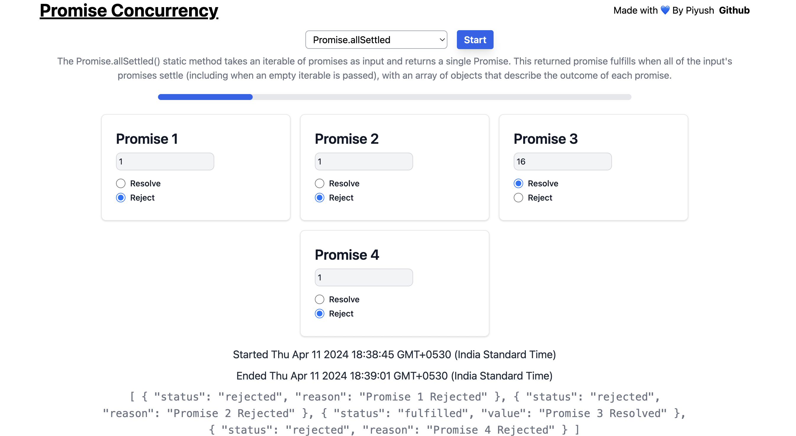

### Javascrip Promise Concurrency

## Overview
This javascript promise concurrecy is eduactional project to see how promise.all, promise.allSettled, promise.race, promise.any works with multiple promises.

## Acknowledgments
Project inspired from https://promiviz.vercel.app/
Definitions taken from official mdn website https://developer.mozilla.org/en-US/docs/Web/JavaScript/Reference/Global_Objects/Promise

## Getting Started
1. Clonse the repository
2. run npm install && npm start && open localhost:3000

## Feeback
Open to all kinds of feedbacks. Please feel free to contact or open issue.
